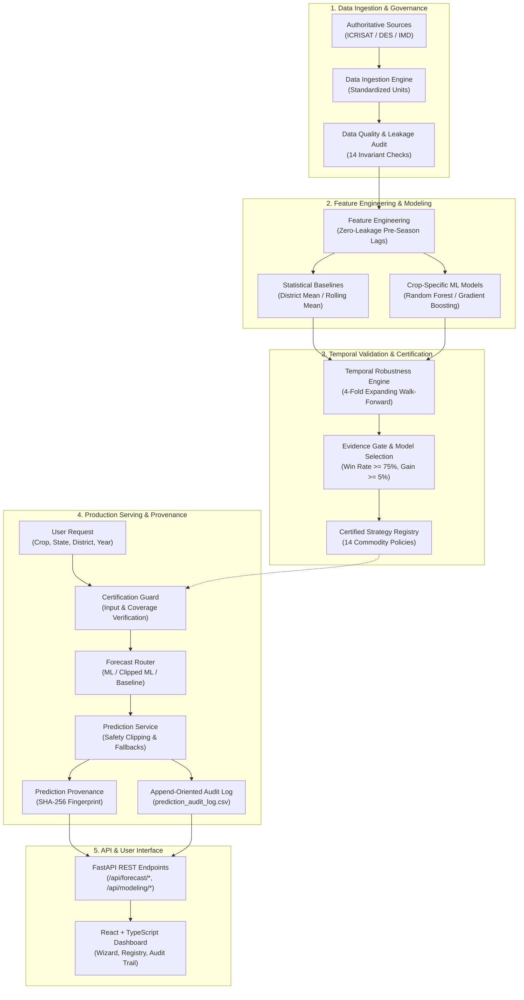

# System Architecture: AI Agriculture Decision Intelligence Platform

## 1. High-Level Architectural Blueprint

The platform implements an end-to-end, multi-tier intelligence pipeline designed for deterministic reproducibility, strict model governance, and full prediction provenance.

---

## 2. Detailed Architectural Subsystems

### Tier 1: Data Ingestion, Standardization & Quality Assurance
- **`src/data_ingestion/`**: Ingests raw ICRISAT, DES, and IMD datasets. Standardizes crop taxonomies, season mappings, and physical units ($\text{yield\_kg\_ha}$, $\text{area\_ha}$, $\text{production\_tonnes}$).
- **`src/data_quality/`**: Runs 14 automated invariant assertions: duplicate record detection, negative value prevention, coordinate plausibility, and yield boundary enforcement ($[0, 150000]$).

### Tier 2: Feature Engineering & Baseline Generation
- **`src/multicrop_pipeline.py`**: Constructs pre-season lag features ($\text{lag-1}$, $\text{lag-2}$, 3-year rolling mean, $\text{area\_lag\_1}$) strictly using historical observations ($t-1, t-2$).
- **`src/multicrop_readiness.py`**: Computes historical district persistence baselines, state baselines, and national benchmark statistics.

### Tier 3: Temporal Validation & Model Certification
- **`src/temporal_robustness_engine.py`**: Executes 4-fold expanding walk-forward temporal evaluation (origins 2014, 2015, 2016, 2017).
- **`src/final_model_certification.py`**: Compares ML candidates against statistical baselines under strict governance criteria. Generates `final_model_certification.csv`.
- **`src/reproducibility_audit.py`**: Performs dual-run bitwise execution tests to guarantee identical predictions ($\Delta = 0.0$).

### Tier 4: Governed Production Serving & Provenance
- **`src/strategy_registry.py`**: Compiles `Models/multicrop/forecast_strategy_registry.json`.
- **`src/certification_guard.py`**: Evaluates pre-inference constraints: rejects uncertified crops (`UNSUPPORTED_CROP`) and unsupported districts (`DISTRICT_UNSUPPORTED`).
- **`src/forecast_router.py`**: Routes validated requests to `PRODUCTION_READY` ML (Oilseeds), `CONDITIONAL_PRODUCTION` ML with 3-$\sigma$ variance clipping (Sugarcane), or `BASELINE_PRODUCTION` statistical persistence (12 crops).
- **`src/prediction_provenance.py`**: Generates cryptographic JSON lineage records containing model hash, validation MAE, fold win rate, and SHA-256 fingerprint.
- **`src/prediction_audit.py`**: Records all successful predictions and rejections to `Datasets/metadata/prediction_audit_log.csv`.

### Tier 5: REST API & Client Application
- **`backend/main.py`**: Exposes 50+ REST endpoints with Pydantic validation schemas.
- **`frontend/src/pages/ForecastIntelligence.tsx`**: React 18 single-page application providing a 4-step wizard, interactive strategy matrix, and real-time audit log monitor.
