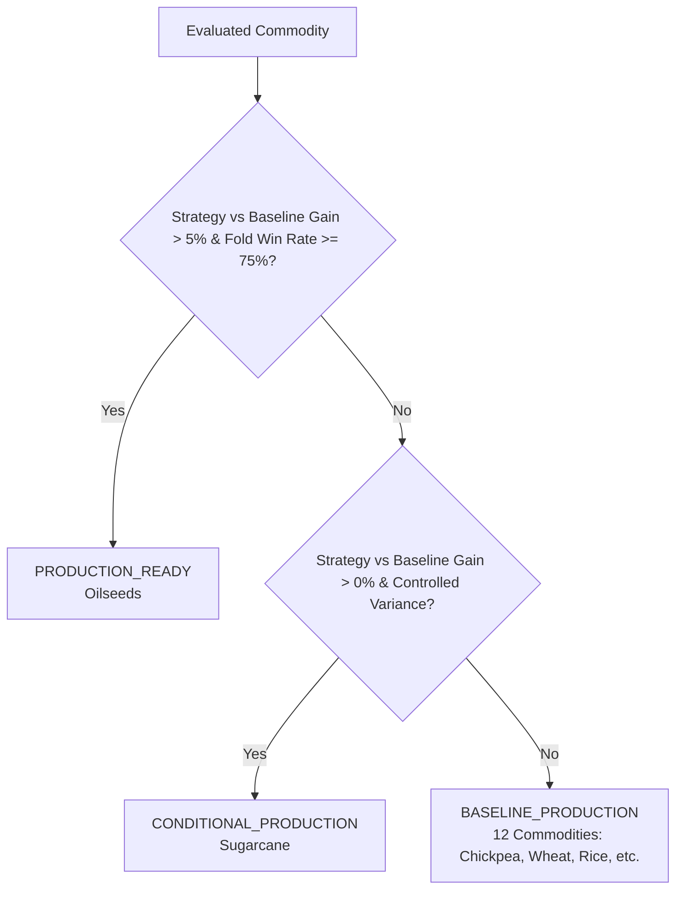

# Day 23: Definitive Model Certification & Operational Taxonomy

## Overview
Authoritative certification framework classifying all 14 evaluated agricultural commodities into deterministic operational deployment tiers based on multi-fold empirical evidence.

---

## 1. Operational Certification Taxonomy

---

## 2. Certified Operational Commodity Specifications

### Tier 1: `PRODUCTION_READY` (1 Commodity)
- **Oilseeds**:
  - **Primary Model**: Historical Machine Learning (`RandomForestRegressor`, `n_estimators=100`, `max_depth=12`).
  - **Fallback Policy**: Historical District Mean if district history $< 5$ observations.
  - **Metrics**: 549.67 kg/ha MAE (+10.85% gain vs Baseline), 75.0% fold win rate, 100% bitwise reproducible.

### Tier 2: `CONDITIONAL_PRODUCTION` (1 Commodity)
- **Sugarcane**:
  - **Primary Model**: Historical Machine Learning (`GradientBoostingRegressor`, `n_estimators=100`, `learning_rate=0.05`).
  - **Fallback Policy**: 3-Sigma Variance Clipping to Historical District Mean bounds.
  - **Metrics**: 1467.97 kg/ha MAE (+1.19% gain vs Baseline), 50.0% fold win rate.

### Tier 3: `BASELINE_PRODUCTION` (12 Commodities)
- **Chickpea, Kharif Sorghum, Minor Pulses, Maize, Wheat, Rice, Sesamum, Pigeonpea, Rapeseed & Mustard, Groundnut, Sorghum, Pearl Millet**:
  - **Primary Model**: Historical District Mean.
  - **Fallback Policy**: 3-Year District Rolling Mean $\to$ State Baseline Mean.
  - **Justification**: Statistical baseline delivers superior or equivalent accuracy compared to ML while eliminating model variance and overfitting risk.
