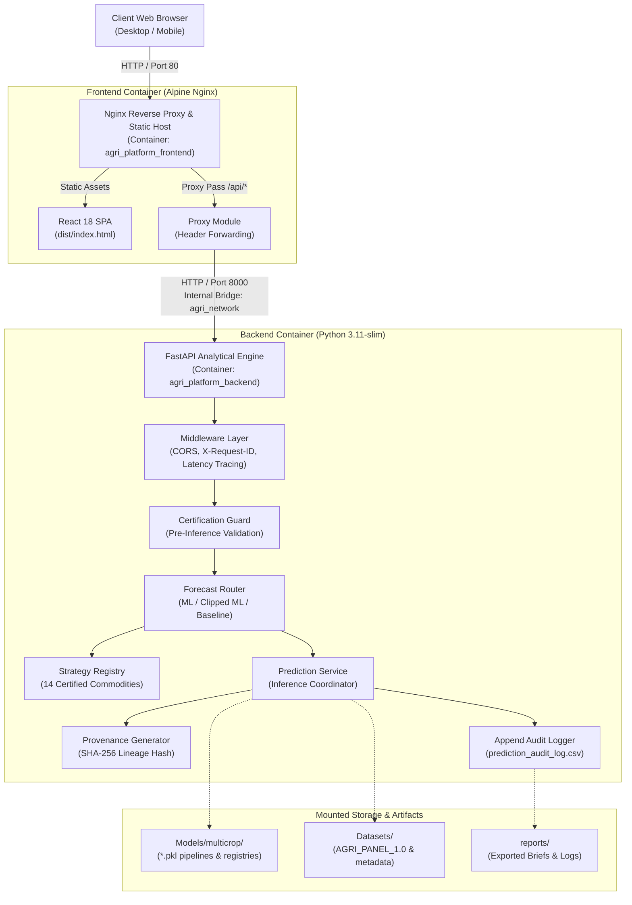

# Day 26: Production Deployment Architecture

## 1. Physical & Network Topology



---

## 2. Containerized Subsystems

### A. Frontend Web Container (`agri_platform_frontend`)
- **Base Image**: `nginx:alpine`
- **Build Strategy**: Multi-stage Docker build utilizing `node:20-alpine` for Vite bundling and `nginx:alpine` for production serving.
- **Port Exposure**: `80:80` (External HTTP Gateway)
- **Key Capabilities**:
  - Gzip compression on all static text, javascript, JSON, and SVG assets.
  - Client-side SPA routing fallback: `try_files $uri $uri/ /index.html;`.
  - Upstream proxy pass for `/api/`, `/health`, and `/ready`.

### B. Backend API Container (`agri_platform_backend`)
- **Base Image**: `python:3.11-slim`
- **User Execution**: Non-root system user `appuser` (UID 10001, GID 10001).
- **Port Exposure**: `8000:8000` (Internal Docker network + Host mapping for debugging).
- **Process Manager**: `uvicorn` production worker binding to `0.0.0.0:8000`.
- **Healthcheck**: Regular automated probe via `curl -f http://localhost:8000/health`.

### C. Network Isolation (`agri_network`)
- Private bridge network enabling internal service discovery between `agri_platform_frontend` and `agri_platform_backend` using Docker container hostnames.

---

## 3. End-to-End Request Lifecycle

```
1. Client issues POST /api/forecast/predict {crop: "Oilseeds", state: "Punjab", district: "Ludhiana"}
2. Nginx receives request on Port 80, injects/preserves X-Request-ID, proxies to backend:8000/api/forecast/predict
3. FastAPI Request Context Middleware records start timestamp, attaches request_id to state
4. CertificationGuard verifies crop ("Oilseeds") is registered and district ("Ludhiana") exists in historical coverage
5. ForecastRouter inspects certification status ("PRODUCTION_READY") and selects RandomForestRegressor pipeline
6. PredictionService executes inference (817.06 kg/ha), constructs SHA-256 cryptographic provenance object
7. PredictionAuditLogger appends record to prediction_audit_log.csv
8. FastAPI returns structured JSON response with headers X-Request-ID and X-Response-Time-Ms
9. Nginx forwards response to client browser
```

---

## 4. Resource Sizing & Production Parameters

| Parameter | Development | Production Staging | Production Scale |
| :--- | :--- | :--- | :--- |
| **CPU Allocation** | 1 Core | 2 Cores | 4 Cores |
| **Memory Allocation**| 2 GB | 4 GB | 8 GB |
| **Uvicorn Workers** | 1 (with reload) | 2 Workers | 4 Workers |
| **Nginx Connections**| 512 | 1,024 | 4,096 |
| **Storage (Panel)** | Local disk | Persistent volume | Cloud block storage (EBS / Persistent Disk) |
