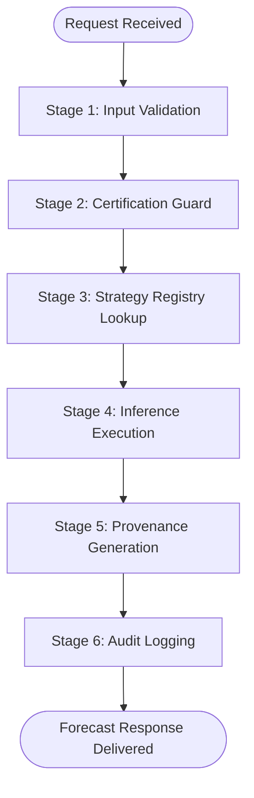

# Day 28: Prediction Trace & End-to-End Governance

## 1. Trace Pipeline Overview

The Prediction Trace feature provides operators and auditors with complete transparency into the step-by-step lifecycle of any forecast request:

---

## 2. Granular Pipeline Stages & Measurements

| Stage | Name | Action Performed | Measured Output |
| :--- | :--- | :--- | :--- |
| **Stage 1** | `INPUT_VALIDATION` | Validates crop, state, district, forecast year, and features. | `duration_ms`, `status` (`COMPLETED`/`FAILED`) |
| **Stage 2** | `CERTIFICATION_CHECK` | Verifies crop governance classification (`PRODUCTION_READY`, `CONDITIONAL_PRODUCTION`, `BASELINE_PRODUCTION`). | `duration_ms`, `certification_status` |
| **Stage 3** | `STRATEGY_LOOKUP` | Resolves authoritative strategy from `forecast_strategy_registry.json`. | `duration_ms`, `strategy_name`, `algorithm` |
| **Stage 4** | `INFERENCE_EXECUTION` | Executes ML pipeline or governed statistical fallback. | `duration_ms`, `prediction` (kg/ha), `fallback_used` |
| **Stage 5** | `PROVENANCE_GENERATION` | Constructs cryptographic SHA-256 fingerprint of input/output context. | `duration_ms`, `provenance_hash` |
| **Stage 6** | `AUDIT_LOGGING` | Writes immutable record to `prediction_audit_log.csv`. | `duration_ms`, `audit_status` (`RECORDED`) |

---

## 3. Provenance and Audit Integration

Each trace record connects directly to the authoritative provenance system:
- **`request_id`**: Universally unique tracking identifier (`REQ-XXXXXXXXXXXX`).
- **`provenance_hash`**: SHA-256 hash guaranteeing unforgeable link between features, model version, operating rules, and yield prediction.
- **Audit Fallback**: If an in-memory trace expires from RAM, the engine dynamically reconstructs the trace from `prediction_audit_log.csv`.
