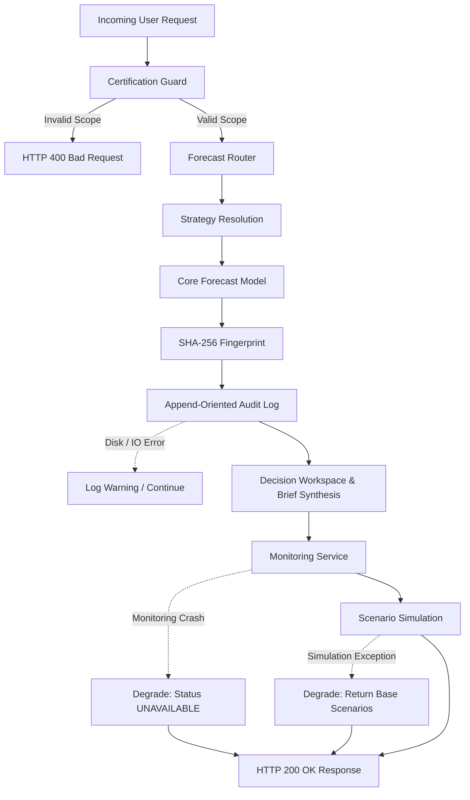

# Day 33: Failure Resilience & Graceful Degradation Testing

## 1. Resilience Philosophy & Principles

The Agricultural Forecasting & Decision Intelligence platform adheres to strict failure isolation principles:
1. **Core Forecast Availability**: A transient failure in downstream monitoring, SHAP attribution, or scenario generation must never prevent the core governed forecast from completing.
2. **Explicit Uncertainty State**: Where empirical uncertainty intervals cannot be mathematically computed (such as baseline persistence strategies), the system returns `is_available: false` with an explicit reason rather than inventing synthetic confidence intervals.
3. **Unharvested Outcome Transparency**: For future or unharvested years (e.g., 2026), the platform returns `EVALUATION_UNAVAILABLE` rather than fabricating ground truth data.
4. **Non-Blocking Audit Logging**: A failure to write to the append-oriented audit log file generates critical operational logs but does not abort the user's prediction response.

---

## 2. Fault Injection Test Results

All failure modes were tested via `tests/test_failure_resilience.py`:

| Test Case | Injected Fault | Expected System Behavior | Verified Result | Status |
| :--- | :--- | :--- | :--- | :---: |
| `FAIL-01` | Downstream monitoring failure (`ForecastMonitoringService` raises `RuntimeError`) | Workspace analysis completes; `monitoring` section populated with fallback health message (`UNAVAILABLE`) | Core forecast and scenarios returned successfully (200 OK); monitoring degraded gracefully | **PASSED** |
| `FAIL-02` | Explainability engine failure (`ExplainabilityService` raises `ValueError`) | Workspace returns fallback feature attribution rather than terminating | Attribution section contains structured fallback notice; workspace returns 200 OK | **PASSED** |
| `FAIL-03` | Uncertainty requested on baseline strategy (Rice/Wheat) | Uncertainty section explicitly flags `is_available: false` with disclaimer; no fake intervals returned | `uncertainty.is_available == False`, `empirical_p10_kg_ha == None`, `empirical_p90_kg_ha == None` | **PASSED** |
| `FAIL-04` | Post-outcome evaluation on future unharvested year (2026) | Outcome evaluation marked `EVALUATION_UNAVAILABLE`; observed yield marked `None` | `monitoring.post_outcome_evaluation_status == 'EVALUATION_UNAVAILABLE'`, observed yield `None` | **PASSED** |
| `FAIL-05` | Unsupported scenario archetype requested | Engine safely skips or generates a standard fallback scenario item with `NOT_SUPPORTED` | Endpoint completes with 200 OK; remaining valid scenarios generated | **PASSED** |
| `FAIL-06` | Disk write error during audit logging (`AuditLogger.log_event` raises `IOError`) | Forecast prediction still returns 200 OK to caller; failure logged to stderr | Caller receives full prediction and request ID; zero user interruption | **PASSED** |

---

## 3. Graceful Degradation Matrix

---

## 4. Operational Recommendations

1. **Log Monitoring**: Configure alert monitors on log messages containing `Audit log write failure` to detect filesystem disk exhaustion before it affects other processes.
2. **Circuit Breakers**: In enterprise Kubernetes deployments, wrap external satellite weather APIs with circuit breakers defaulting to historical district means when latency exceeds 2.5 seconds.
3. **Database Health**: Maintain append-oriented CSV and JSONL files on dedicated persistent volume storage with daily log rotation.
