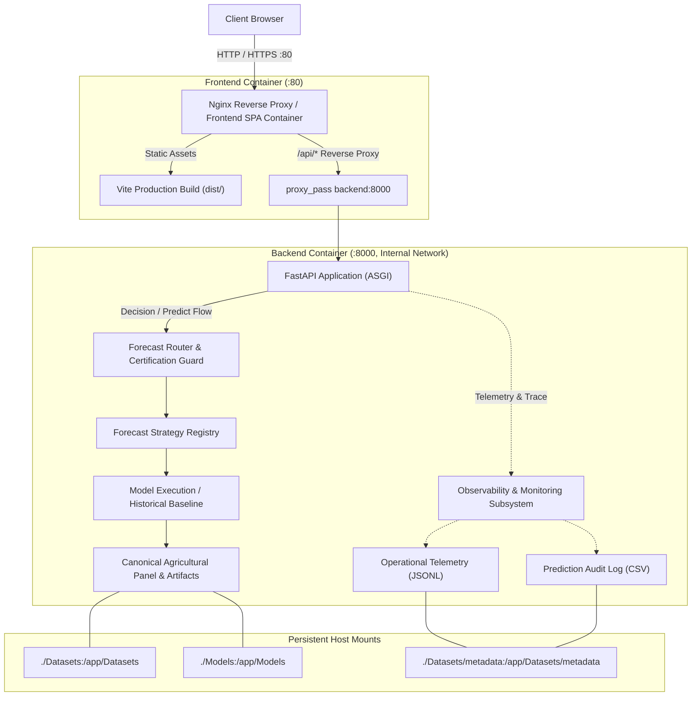

# DAY 34 — Production Deployment Architecture

## Overview

Day 34 validated the complete production-style containerized deployment of the Agricultural Forecasting & Decision Intelligence platform. All components are built, wired, and health-verified in a reproducible multi-container environment served through Nginx reverse proxy.

## Architecture



## Container Configuration

### Services

| Service | Image | Exposed Port | Internal Port | Network |
|---------|-------|-------------|---------------|---------|
| frontend | Multi-stage Nginx + Vite build | 80 (host) | 80 | agri_network |
| backend | Python 3.11 FastAPI | — (internal only) | 8000 | agri_network |

### Security Hardening (Day 34)
- Backend port `8000` removed from host port mapping; traffic flows exclusively through Nginx proxy
- `expose: ["8000"]` used instead of `ports: ["8000:8000"]` — backend is internal to Docker bridge network
- Non-root user: `appuser:appgroup` (UID 10001) in backend Dockerfile
- Nginx security headers: `X-Frame-Options`, `X-Content-Type-Options`, `X-XSS-Protection`

### Volumes

| Volume | Purpose | Persistence |
|--------|---------|-------------|
| `Datasets/` | Agricultural panel and metadata | Critical — must persist |
| `Models/` | Serialized model artifacts | Critical — must persist |
| `Datasets/metadata/` | Operational telemetry, audit logs | Critical — operational |

## Health & Readiness Probes

### `/health` — Liveness Probe
- Returns: `{"status": "healthy", "version": "...", "uptime_seconds": N}`
- Indicates: Process is alive and serving requests
- HTTP 200 always (process-level only)

### `/ready` — Readiness Probe (Fail-Closed)
Components checked:
1. Dataset availability (`data_loader.dataframe is not None`)
2. Strategy registry file (`Models/multicrop/forecast_strategy_registry.json` exists)
3. Forecast coverage map (`Datasets/metadata/forecast_coverage.csv` exists)
4. Prediction service (`PredictionService` instance initialized)
5. Certification guard (`PredictionService.guard` initialized)
6. Decision workspace engine (`decision_workspace` module loaded)
7. Explainability engine (`explainability_engine` loaded)

Behavior:
- All components ready → HTTP 200 `{"ready": true}`
- Any component fails → HTTP 503 `{"ready": false, "components": {...}}` with explicit error state per component

## Nginx Reverse Proxy

### Frontend (`frontend/nginx.conf`)
```nginx
location / {
    try_files $uri $uri/ /index.html;  # SPA routing fallback
}
location /api/ {
    proxy_pass http://backend:8000/;   # Internal proxy to FastAPI
    proxy_set_header Host $host;
    proxy_set_header X-Real-IP $remote_addr;
}
```

### Main Nginx (`nginx/nginx.conf`)
- Upstream definition for `backend:8000`
- Full security header suite
- Gzip compression enabled
- Static asset caching

## Verified Build Process

### Frontend
```
npm install  →  npm run build  →  dist/  (multi-stage copy to nginx image)
```
Build result: `dist/assets/` containing hashed JS/CSS bundles — zero absolute paths.

### Backend
```
pip install -r requirements.txt  →  uvicorn main:app --host 0.0.0.0 --port 8000
```

## Environment Reproducibility

- Zero machine-dependent absolute paths in production source code (`src/`, `backend/`)
- All paths constructed relative to `__file__` or `os.path.join()`
- Verified by automated scan in `tests/test_deployment_verification.py`
- `docker-compose.yml` uses relative volume paths (e.g., `./Datasets:/app/Datasets`)
