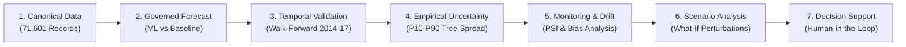

# DAY 35 — Product Information Architecture (IA)

## 1. Overview

The Agricultural Forecasting & Decision Intelligence platform organizes complex multi-crop forecasting, temporal validation, continuous monitoring, and scenario simulation into four primary functional domains. The architecture allows an executive or researcher to progress intuitively from exploratory forecasting to rigorous evidence evaluation and multi-scenario decision support.

---

## 2. Navigation Hierarchy & Route Map

```
HOME (/)
│
├── EXPLORE
│   ├── Prediction Explorer (/prediction-explorer)
│   │   └── Governed pre-season predictions with empirical baseline comparisons & attribution
│   └── Forecast Service (/forecast)
│       └── Governed multi-crop yield prediction API & parameter inspection
│
├── MONITOR
│   ├── Forecast Monitoring (/forecast-monitoring)
│   │   └── Post-outcome evaluation, covariate drift (PSI), error diagnostics & bias
│   ├── Observability Center (/observability)
│   │   └── Runtime telemetry, request traces, model integrity & alerts
│   └── Temporal Monitoring (/monitoring)
│       └── Continuous signal surveillance & change detection
│
├── DECIDE
│   ├── Decision Workspace (/decision-workspace)
│   │   └── Multi-scenario comparison workspace with baseline forecasts & evidence inspection
│   ├── Decision Brief (/decision-intelligence)
│   │   └── Auditable policy briefs, agronomic trade-offs, and supply shock analysis
│   ├── Scenario Lab (/scenario)
│   │   └── What-if parameter simulations under modified input assumptions
│   └── Early Warning Engine (/early-warning)
│       └── Theil-Sen statistical trend diagnostics & regime shift detection
│
└── GOVERNANCE & SCIENCE
    ├── Model Governance (/modeling-readiness)
    │   └── 14-crop tournament evaluations and certified strategy registries
    ├── Scientific Validation (/science)
    │   └── Whitepaper on expanding walk-forward methodology & leak prevention
    ├── Agricultural Data Portal (/portal)
    │   └── 71,601 unified records across 20 Indian states and 311 districts
    ├── Yield Verification (/calculator)
    │   └── Post-harvest deterministic agronomic identity consistency check
    └── Agricultural AI Copilot (/copilot)
        └── Evidence-grounded agronomic assistant for query reasoning
```

---

## 3. Analytical Pipeline Sequence

The product experience follows a strict 7-stage analytical flow:



1. **Canonical Data**: Clean, versioned panel dataset without runtime modifications.
2. **Governed Forecast**: Certification guard selects certified ML (e.g. Oilseeds) or statistical baseline (e.g. Rice).
3. **Temporal Validation**: Rigorous out-of-sample expanding walk-forward evaluation preventing future leakage.
4. **Empirical Uncertainty**: Dispersion across trained decision trees, explicitly distinguished from frequentist confidence intervals.
5. **Monitoring & Drift**: Continuous tracking of feature distributions and post-outcome errors.
6. **Scenario Analysis**: Hypothetical input modifications clearly tagged as `[SCENARIO]`.
7. **Decision Support**: Evidence synthesis presenting trade-offs to human decision-makers without autonomous prescription.
