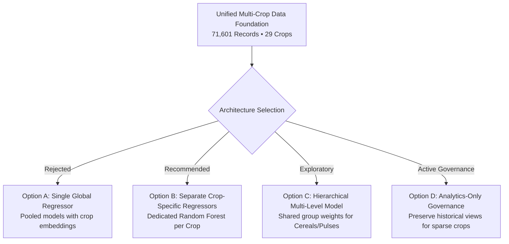

# Multi-Crop Model Architecture Decision

## Executive Summary
This research document establishes the empirical and agronomic justification for model architecture selection when extending the **AI Agriculture Decision Intelligence Platform** from its single-crop Rice baseline to multi-crop capabilities.

Based on target scale disparity, variance heterogeneity, and baseline benchmarking across 29 crops, **Separate Crop-Specific Regressors (Architecture Option B)** are **Empirically Justified**, while a **Global Single Regressor (Architecture Option A)** is **Scientifically Disfavored**.

---

## 1. Architectural Paradigms Evaluated

### Comparative Trade-off Matrix

| Dimension | Option A: Global Pooled Model | Option B: Crop-Specific Models (Recommended) | Option C: Hierarchical Models |
| :--- | :--- | :--- | :--- |
| **Agronomic Validity** | Poor (conflates cereal/pulse/oilseed biology) | **Optimal** (respects individual physiological limits) | Moderate (partial group sharing) |
| **Target Scale Invariance** | Low (severe bias toward high-yield crops like Sugarcane/Maize) | **High** (each model operates on crop-native scale) | Moderate |
| **Feature Attribution (Tree SHAP)** | Confounded by cross-crop interactions | **Clean & Interpretable** | Mixed |
| **Validation Rigor** | Risk of mask-leakage across crop cycles | **Independent Out-of-Time CV** | Group-level complexity |
| **Deployment Complexity** | Single binary artifact | 14 dedicated binary artifacts | Intermediate |

---

## 2. Empirical Findings Justifying Crop-Specific Architecture

### 2.1 Extreme Target Scale Disparity
The empirical yield distributions across the 29 crops vary by more than **$100\times$**:
- **Sugarcane**: Mean yield $\approx 55,000\text{–}65,000\text{ kg/ha}$
- **Maize**: Mean yield $\approx 2,750\text{ kg/ha}$
- **Rice**: Mean yield $\approx 2,150\text{ kg/ha}$
- **Wheat**: Mean yield $\approx 2,680\text{ kg/ha}$
- **Sesamum**: Mean yield $\approx 410\text{ kg/ha}$
- **Chickpea**: Mean yield $\approx 920\text{ kg/ha}$
- **Cotton**: Mean yield $\approx 350\text{ kg/ha}$ (lint)

A global model attempting to minimize mean squared error ($L_2$ loss) on pooled raw yields will disproportionately optimize for high-magnitude crops (Sugarcane/Maize) while completely ignoring error gradients on lower-yielding, economically critical pulses and oilseeds.

### 2.2 Biological & Agronomic Mechanism Incompatibility
- **Water Response**: Rice requires flooded paddy conditions ($>1,000\text{ mm}$ water); Chickpea and Sorghum are semi-arid dryland crops vulnerable to waterlogging.
- **Nutrient Efficiency**: Nitrogen response curves that improve Wheat yields cause vegetative lodging in Pigeonpea.
- **Cropping Calendar**: Kharif crops depend on Southwest Monsoon onset (June–Sept); Rabi crops depend on post-monsoon soil moisture and irrigation (Oct–March).

### 2.3 Baseline Performance Evidence
Across the 98 baseline model evaluations on chronological out-of-time test sets (2016–2017):
- **Historical District Mean** and **Naive Persistence** achieved localized $R^2 > 0.60$ for crops with continuous coverage (Rice: $R^2=0.67$, Wheat: $R^2=0.76$, Groundnut: $R^2=0.62$, Castor: $R^2=0.77$).
- **Historical Crop Mean** (national pooling) failed completely ($R^2 < 0$), demonstrating that national crop aggregation destroys localized predictive power.

---

## 3. Policy Recommendation

1. **Adopt Crop-Specific Models**: Train and deploy dedicated regressor pipelines for the **14 `MODEL_READY` crops**.
2. **Preserve Analytics-Only Status**: Retain the **9 `ANALYTICS_READY` crops** in historical reporting without forcing unreliable predictive pipelines.
3. **Quarantine Insufficient Categories**: Maintain the **6 `INSUFFICIENT_DATA` crops** in exploratory metadata.
4. **Preserve Validated Rice Model**: Keep the active Rice Random Forest model ($R^2=0.7866$, $\text{MAE}=353.01\text{ kg/ha}$) as the benchmark.
